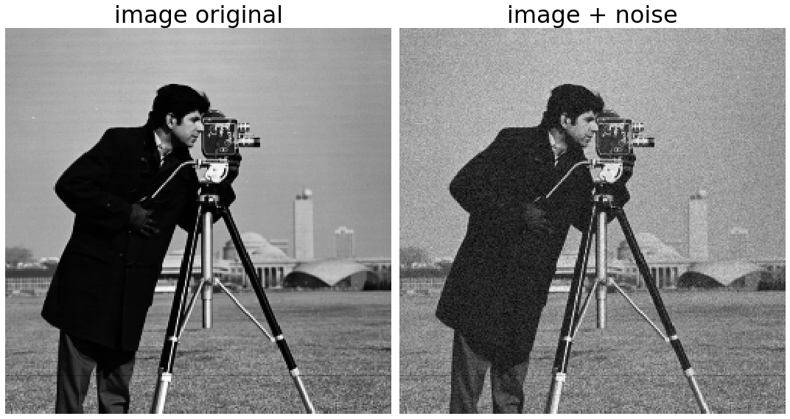

demo_edge_detectors_utils.py

four edge detectors:
    
    (1) Sobel edge detector
        Strong response for horizontal and vertial edges
        
    (2) Laplacian edge detector:
        Strong response for horizontal, vertial and diagonal edges
        
    (3) Single line directional edge detector:
        Strong response for single line horizontal, vertial or diagonal edges
    
    (4) Canny edge detector:
        Strong response for horizontal, vertial and diagonal edges

Sample image: 

  

Four image edge detectors: 

  

